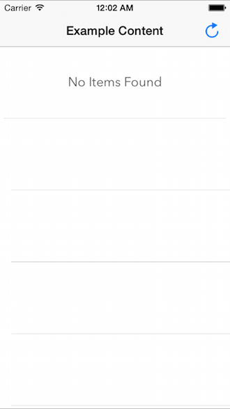
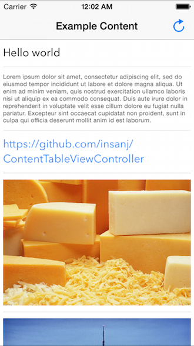

# ContentTableViewController

Super simple way to present content. A template table view that can take several kinds of objects and present them on-the-fly with **one line of code**. Customization of the view controller can be done as expected, customization of the table view can be done by accessing `contentController.tableView`, and customization of the cells can be done through a few [ContentTableViewController](https://github.com/insanj/ContentTableViewController/blob/master/Pod/Classes/ContentTableViewController.h) options.

**Supported Object Types:**

- NSString
- NSArray
    - NSString
- UIImage

 

## Usage

	ContentTableViewController *contentController = [[ContentTableViewController alloc] initWithItems:@[@"Hello", @"World"]];
	contentController.contentDelegate = self; // for interaction (contentTableViewController:didTapItem:)	

To see and run [the full example project](https://github.com/insanj/ContentTableViewController/blob/master/Example/ContentTableViewController/INSViewController.m
), clone the repo, and run `pod install` from the Example directory first.

## Installation

ContentTableViewController is available through [CocoaPods](http://cocoapods.org). To install
it, simply add the following line to your Podfile:

    pod "ContentTableViewController"

## Author

[Julian (insanj) Weiss](https://twitter.com/insanj), [julian@urlinq.com](mailto:julian@urlinq.com)

## License

	ContentTableViewController: super simple way to present content.
	Copyright (C) 2015 Julian (insanj) Weiss
	
    This program is free software: you can redistribute it and/or modify
    it under the terms of the GNU General Public License as published by
    the Free Software Foundation, either version 3 of the License, or
    (at your option) any later version.

    This program is distributed in the hope that it will be useful,
    but WITHOUT ANY WARRANTY; without even the implied warranty of
    MERCHANTABILITY or FITNESS FOR A PARTICULAR PURPOSE.  See the
    GNU General Public License for more details.

    You should have received a copy of the GNU General Public License
    along with this program.  If not, see <http://www.gnu.org/licenses/>.