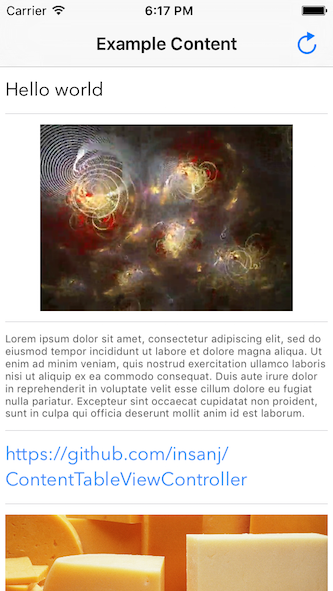

# ContentTableViewController

Super simple way to present content. A template table view that can take several kinds of objects and present them on-the-fly with **one line of code**. Customization of the view controller can be done as expected, customization of the table view can be done by accessing `contentController.tableView`, and customization of the cells can be done through a few [ContentTableViewController](https://github.com/insanj/ContentTableViewController/blob/master/Pod/Classes/ContentTableViewController.h) options.

 

**Supported Object Types:**

- `NSString` (Plain Text)
- `NSAttributedString` (Rich Text)
- `NSURL` (Hyperlink)
- `UIImage` (Image)
- `UIView` (Custom View)
- `ContentVideoItem` (Video URL)

## Usage

	ContentTableViewController *contentController = [[ContentTableViewController alloc] initWithItems:@[@"Hello", @"World"]];
	contentController.contentDelegate = self; // for interaction (contentTableViewController:didTapItem:)	

To see and run [the full example project](https://github.com/insanj/ContentTableViewController/blob/master/Example/ContentTableViewController/INSViewController.m
), clone the repo, and run `pod install` from the Example directory first.

## Installation

ContentTableViewController is available through [CocoaPods](http://cocoapods.org). To install
it, simply add the following line to your Podfile:

    pod "ContentTableViewController"

## Author

[Julian (insanj) Weiss](https://twitter.com/insanj), [insanjmail@gmail.com](mailto:insanjmail@gmail.com)

## License

	ContentTableViewController: super simple way to present content.
	Copyright (C) 2015-2016 Julian (insanj) Weiss
		
	Permission is hereby granted, free of charge, to any person obtaining a copy of this software and associated documentation files (the "Software"), to deal in the Software without restriction, including without limitation the rights to use, copy, modify, merge, publish, distribute, sublicense, and/or sell copies of the Software, and to permit persons to whom the Software is furnished to do so, subject to the following conditions:
	
	The above copyright notice and this permission notice shall be included in all copies or substantial portions of the Software.
	
	THE SOFTWARE IS PROVIDED "AS IS", WITHOUT WARRANTY OF ANY KIND, EXPRESS OR IMPLIED, INCLUDING BUT NOT LIMITED TO THE WARRANTIES OF MERCHANTABILITY, FITNESS FOR A PARTICULAR PURPOSE AND NONINFRINGEMENT. IN NO EVENT SHALL THE AUTHORS OR COPYRIGHT HOLDERS BE LIABLE FOR ANY CLAIM, DAMAGES OR OTHER LIABILITY, WHETHER IN AN ACTION OF CONTRACT, TORT OR OTHERWISE, ARISING FROM, OUT OF OR IN CONNECTION WITH THE SOFTWARE OR THE USE OR OTHER DEALINGS IN THE SOFTWARE.